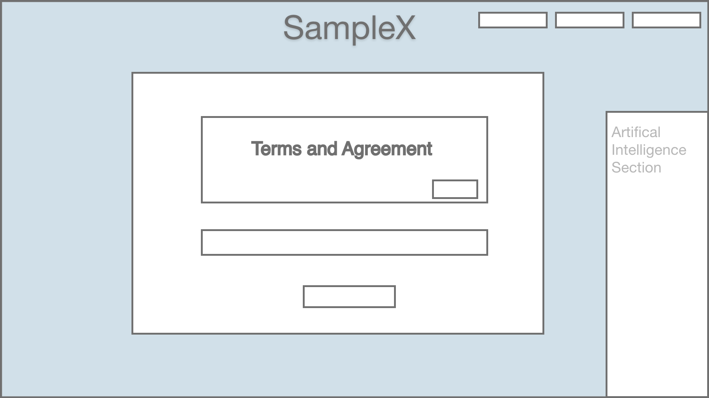
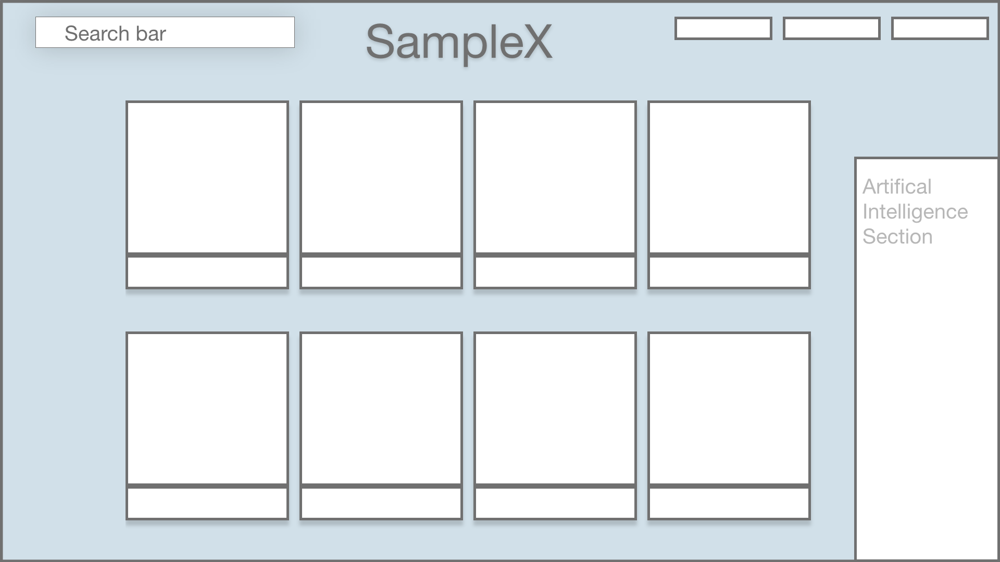

# SampleX 
Vs 1.0
Project Deployment Date: TBD

## Project Proposal
**What is the idea behind SampleX?**

   You can instantly order toilet paper, so why not samples? It is a systematic approach to sending and receiving samples for    product development. 

   This delivery method is specifically designed for sample parts to encourage faster innovation and end product development.

   The faster the customer has a product, the faster they can sell to consumers and the faster they set up ongoing bulk supply    orders from suppliers. 

**Problem**
* Many engineers, scientists, researchers and product developers need to get a hold of samples made by suppliers to      create  products. This can be a lengthy process. Research and  interviews with customers show this can take anywhere from 3 weeks      to 6 months and is a major problem to customers.

   * Majority of suppliers will send samples manually:
       * Not much resources to deliver the samples to their customers
       * No time to send out (ex 10,000 samples) and communicate with everyone
       * Have admin mail out samples on top of stressful workload which can be forgotten
       * Many emails back and forth that can get lost amongst other emails and action items
       * Wrong samples set
       * No samples sent resulting in a missed business opportunity as a customer seals the deal with a competitor.

**Target**
   * Divisions in chemical and manufacturing companies in the USA such as :
       * PhillipsPlastics
       * SMC
       * 3M 
       * Exxon
       * Boston Scientific
       * And many more….

**Solution**
   * A shopping cart for samples (updated by the supplier - No coding experience with user friendly design)
   * Automatic Instant notification to customer email or text that the order has been placed
   * Automatic Instant email to supplier that a customer ordered a sample and what type of sample needed
   * A place where supplier can send/update tracking info easily
   * The tracking info is sent to the supplier via email
   * Very user friendly design
   * Collaborative with user input that is instantly updated  (later stages)
   * A bot to answer questions about sample set (updated by supplier - No coding experience as it is user friendly) 
   * A page that suppliers can send a mass email (video/text new product update/applications)  to mailing list (email customers or customer's intranet) 
   * Automatic feedback sent to customer after they received the samples
   * Feedback from customers that go directly to the supplier's database (need different specs/color/liked it…user experience)

**Benefits of the SampleX Application**

   * Increase lead time
   * Professional 
   * Automated 
   * Less customer emails/calls/meetings
       * Bot is programmed to answer majority of questions. 
           *If not a link sent to a live person (later stages)
           *Frequent question answer page created
       * Customer can just order what they need and see the tracking
   * Customers see new product applications and development from suppliers that can inspire innovation or solve problems. They have access to this information easily.
   * Easy to send feedback
   * Easy to collect feedback through data collection sheet

## Rough Sketch of Final Product

web 1920

Login Page

Product Developer Page - Agreement

Product Developer Page - Shopping Cart

Product Developer Page - Checkout/Submission 

## Built Utilizing
* Bootstrap v4 - https://stackpath.bootstrapcdn.com/bootstrap/4.1.3/css/bootstrap.min.css 
* Material Design for Bootstrap 4 - https://mdbootstrap.com/material-design-for-bootstrap/ 
* jQuery 3.x - http://code.jquery.com/jquery-3.3.1.min.js

## Case Study

