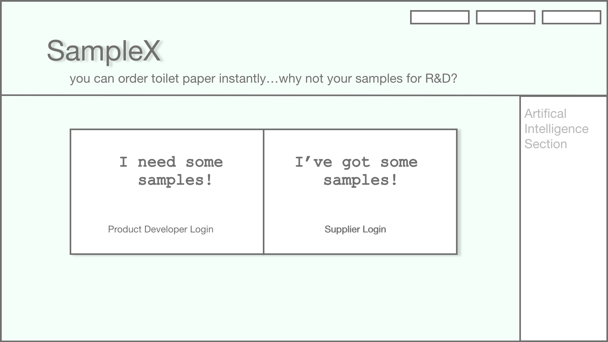
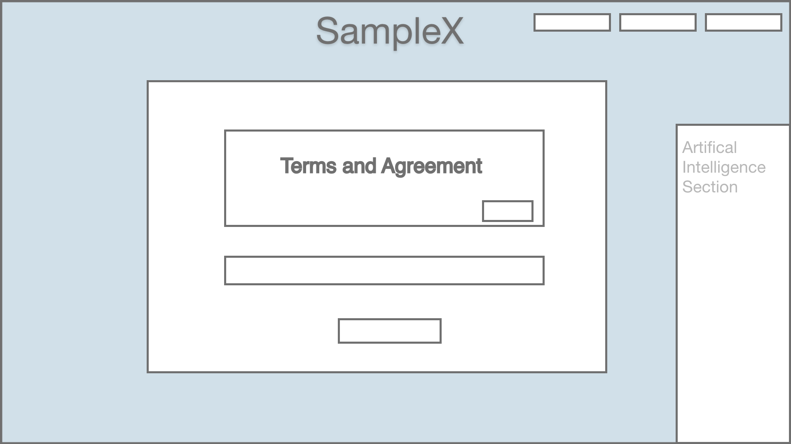
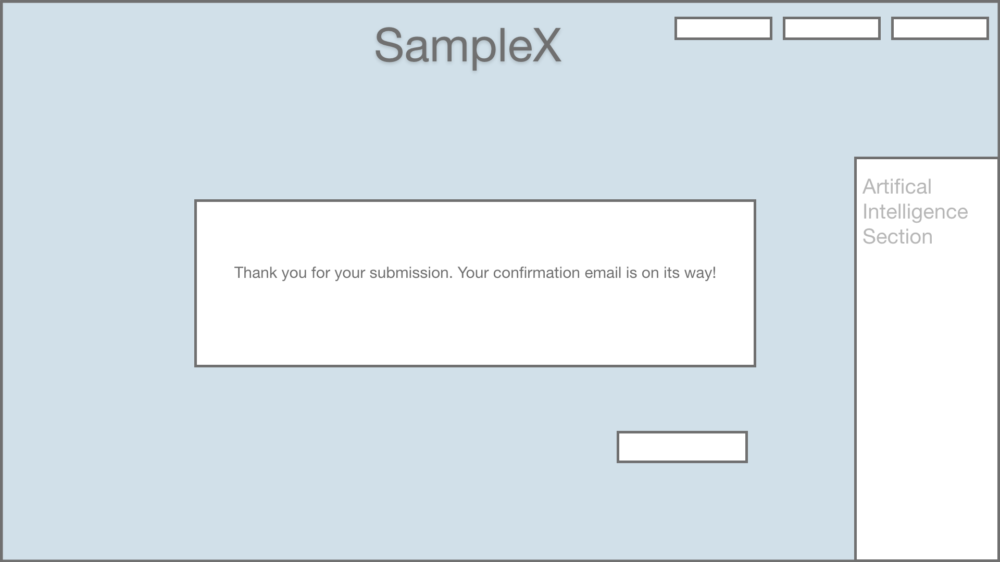

# SampleX 

Vs 1.0 Deployment Date: Feb 4, 2019


## PROJECT PROPOSAL

A SAMPLE DATABASE & MARKETPLACE 
* Search **Millions** of Samples Across Multiple Networks all in one spot!

**What is the idea behind SampleX?**

   You can instantly order toilet paper, so why not samples? It is a systematic approach to sending and receiving samples for    product development. This delivery method is specifically designed for sample parts to encourage faster innovation and end    product development. The faster the customer has a product, the faster they can sell to consumers and the faster they setup    ongoing bulk supply orders from suppliers. 

**PROBLEM**
* Many engineers, scientists, researchers and product developers need to get a hold of samples made by suppliers to      create  products. This can be a lengthy process. Research and  interviews with customers show this can take anywhere from 3 weeks      to 6 months and is a major problem to customers.

   * Majority of suppliers will send samples manually:
       * Not much resources to deliver the samples to their customers
       * No time to send out (ex 10,000 samples) and communicate with everyone
       * Have admin mail out samples on top of stressful workload which can be forgotten
       * Many emails back and forth that can get lost amongst other emails and action items
       * Wrong samples set
       * No samples sent resulting in a missed business opportunity as a customer seals the deal with a competitor.

**TARGET**
   * Divisions in chemical and manufacturing companies in the USA such as :
       * PhillipsPlastics
       * SMC
       * 3M 
       * Exxon
       * Boston Scientific
    * Universities
       * And many more….


**SOLUTION**
   * A shopping cart for samples (updated by the supplier - No coding experience with user friendly design)
   * Automatic Instant notification to customer email or text that the order has been placed
   * Automatic Instant email to supplier that a customer ordered a sample and what type of sample needed
   * A place where supplier can send/update tracking info easily
   * The tracking info is sent to the supplier via email
   * Very user friendly design
   * Collaborative with user input that is instantly updated  (later stages)
   * A bot to answer questions about sample set (updated by supplier - No coding experience as it is user friendly) 
   * A page that suppliers can send a mass email (video/text new product update/applications)  to mailing list (email customers or customer's intranet) 
   * Automatic feedback sent to customer after they received the samples
   * Feedback from customers that go directly to the supplier's database (need different specs/color/liked it…user experience)

**BENEFITS**

   * Increase lead time
   * Professional 
   * Automated 
   * Less customer emails/calls/meetings
       * Bot is programmed to answer majority of questions. 
           *If not a link sent to a live person (later stages)
           *Frequent question answer page created
       * Customer can just order what they need and see the tracking
   * Customers see new product applications and development from suppliers that can inspire innovation or solve problems. They have access to this information easily.
   * Easy to send feedback
   * Easy to collect feedback through data collection sheet

## ROUGH SKETCH

web 1920

Login Page



Product Developer Page - Agreement



Product Developer Page - Shopping Cart


Product Developer Page - Checkout/Submission 




## BUILT UTILIZING
* Bootstrap
* jQuery 
* React Components
* No SQL - MongoDB
* Express
* Node.js
* D3.js
* Cheerio
* Axios

## CASE STUDY

#### BACKGROUND
   Currently, in Vs. 1.0, each item is manually entered and then shown in the shopping area. The end user has to scroll down to view all products. In the case we will look at the problems and solutions to improve the way products are generated in the  shopping cart (Iteration I) and improve the user search experience through interface (Iteration II). 


#### 1.) Iteration I:

##### * RESEARCH & DISCOVERY 

###### User Research

Interviews were conducted with potiental users to understand what they want displayed when searching for samples.

From user interviews and feedback, a few different use cases were discovered for displayed results:
   
   ```
   User desires more products from many different companies displayed
  
   ```
   

###### Discovery
   Currently, there are only 6 products generated on the app. This does not give Engineers and product developers enough          information or options. In order to create a marketplace many different companies will need to participate. Engineers and      product developers need a dynamic array of sample options to choose from. 

##### * DESIGN EXPLORATION

There were two different ways to solve this problem. 

I) Web Data Extraction

   * In order to provide users with more options, there is a possiblity of third party Web Data Extraction. That would take        public information/products from several company website and generate it onto our app. A variety of laws may apply to          unauthorized scraping, including contract, copyright and trespass to chattels laws. 

   * If going with this option then we need documented consent from each company participating in our marketplace with a            letter of conduct and compliance with any legal obligations.
   
      * Prevent the Scraping of Sensitive Data
      * Minimise the Extent of The Data Extraction
      * Ensure Data Is Used For Legitimate Business Purposes Only
      * Ensure The Correct Data Retention And Access Policies Are In Place
      
     *Use npm packages for webscraping - 
      
    npm install cheerio  (Opens the URL) 
    npm install axios (Load the response data (HTML data) into cheerio and assign it to variable)
    

 II ) Open Source Individual Contribution
 
   * Create a login for Suppliers/Contributors. Individuals can upload their product samples directly to the app. 
   * Ensure personal data storage is EU’s General Data Protection Regulation (GDPR) compliant.
  
In both Web Data Extraction or Open Souce Individual Contributions, we will need to completely remove any data off the app if  the user or company needs the information taken off. 

##### * FINAL SOLUTION

TBD

#### 2.) Iteration II: Search Experience

##### * RESEARCH & DISCOVERY 

###### User Research 

   Interviews were conducted with potiental users to understand what they prioritize when searching for samples.

   From user interviews and feedback, a few different use cases were discovered for search queries:
```
   User looking for any products by company
   User looking for any products by grade
   User looking for any products by material specifications
   User looking for a certain type of product by technology
   User looking for a specific product by exact match
```

###### Discovery
There were no existing search filters, however users would like to filter by one attribute of a category at a time or select many attributes to give users the flexibilty to explore results they wanted with a range of products they could choose from. 

##### * DESIGN EXPLORATION

TBD

##### * FINAL SOLUTION

TBD

